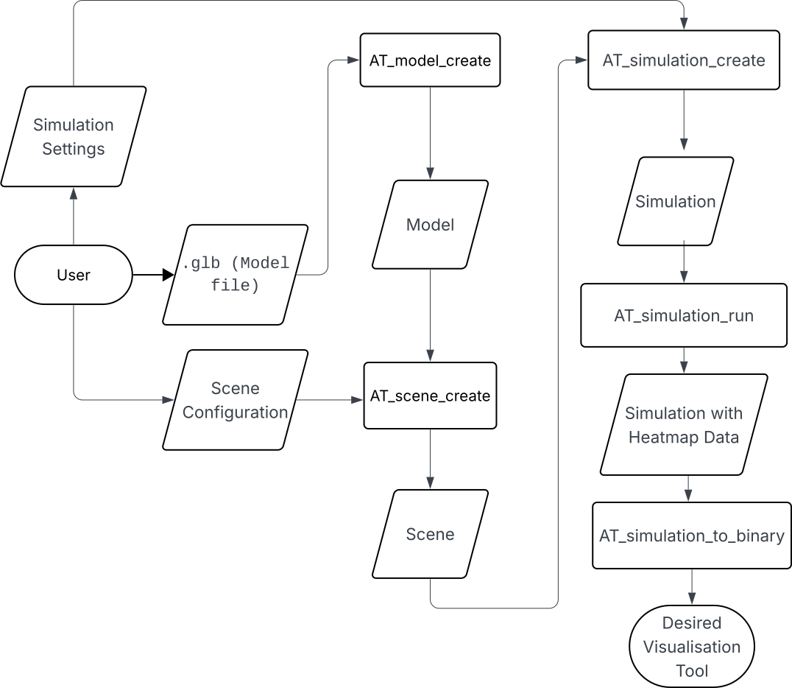

# Acoustic Tracer

## Authors

GitHub Repository Link: [Acoustic Tracer](https://github.com/Acoustic-Resonance/AcousticTracer)

Team Members:

- Alex Wright (123439374) - Simulation Core / Front-end
- Patryk Mrozek (123435202) - Simulation Core
- Eoghan Murphy (123330861) - Simulation Core / Optimisation
- Michael McCarthy (123340421) - Front-end

## Integrity

This project and its outputs were created solely by the individual team members.
Gen AI was used for the purpose of debugging,
and the explanation of complex topics in tandem with academic papers, and language/library documentation.

## Introduction

Our project 'Acoustic Tracer' is a three-dimensional, acoustic visualiser that allows users to visualise sound travelling throughout a modelled environment as a heat map. At the core it is a C library, where the user can read in a `.glb` file (3D Model File), insert one or more speakers, specify simulation settings, and receive back a heat map of how the sound travelled through the environment over time. Our final project extends it into a web-based application that renders this heat map and makes the configuration of the scene and simulation more user-friendly, while also allowing more technical users to achieve their desired configuration. A user can create an account, upload `.glb` model files, view the models in a 3D scene-viewer, configure the scene and simulation settings, and finally run the simulation, returning a heat map which they can play through and replay at a later time if desired. The aim of this project was to create a unique software that could be used by architects, acoustic specialists, or anyone who desires to model how sound travels through their environment. This was also a passion project to explore the potential and concept of ray-tracing, along with creating a software that people would actually use.

## Previous Works

Prior to beginning development, we surveyed the existing landscape of acoustic simulation tools to understand what was already available and where gaps lay.

**ODEON**[^ref6] is one of the most established tools in room acoustic simulation. It uses a combination of the image-source method and a modified ray-tracing algorithm to predict, illustrate and auralise the acoustics of 3D environments. It is a mature, commercially licensed desktop application used widely by acoustic engineers and architects. However, it is closed-source, expensive, and desktop-only, requiring a hardware dongle for licensing. This made it unsuitable as a reference point for an open, browser-accessible tool.

**CATT-Acoustic**[^ref7] is another commercial desktop application for room acoustics simulation, also using ray-tracing based methods. Like ODEON, it is a proprietary, paid, desktop-only product targeted at professional acoustic consultants.

**I-Simpa**[^ref8] is an open-source GUI developed by Université Gustave Eiffel for hosting 3D numerical acoustic propagation codes. It supports ray-tracing and sound-particle tracing methods and is the closest open-source equivalent to ODEON. However, it is still a desktop application, requires separate numerical code plugins to function as a simulator, and is not designed to be embedded in or accessed via a web interface.

None of the tools we found offered a browser-based interface, real-time 3D visualisation of sound energy propagation as a voxel heat map, or a clean separation between a portable C simulation core and a platform-agnostic frontend. The volumetric, temporal voxel grid approach we implemented, where each voxel independently records a time-binned energy history, does not appear to be a design used by any of the tools above, which typically output room impulse response parameters or auralisation rather than a spatial energy distribution over time.

## Architecture

Upon starting the project our first task was to set up the shared GitHub repository where our code was to be hosted. This was an involved process with the whole team, as we wanted to ensure a proper workflow with professional version control standards. We set up an organisation, as to not have a single person hosting the repository. We then created the repository `AcousticTracer` where we each forked it, giving ourselves a personal 'copy' of the repository to serve as our `origin`. We then connected the organisation's repository as the remote `upstream` where we could merge changes from our personal forks to the organisation. This allowed us to each work independently on features in parallel and then push these changes into a shared repository. We configured approval rules to ensure that members could not approve their own pull requests, and that each pull request required at least one approval before merging into the main branch. Finally, we implemented 'issues' that each member could view and mark as completed once implemented. This allowed us to keep a 'to-do' list, that we could delegate tasks for, and link specific commits to once finished.

Once the GitHub had been configured the next step was to work on the C library specification, since that is the core aspect of the project. The C Library will henceforth be referred to as the 'core' of the project. The members working on the core of the project began at the 'top' of the core, creating the specification and outline of the public API presented by the core to the end user. Our initial scope of the project included a 'command buffer' that the output would be written to. The idea behind the command buffer was that the output of the simulation would be instructions for any graphics engine (OpenGL, Vulkan, etc.), on how to draw our heat map. This was in the hopes to create a truly independent, graphics library agnostic implementation, but this was later scrapped due to the complexity. We decided on creating a consistent communication standard instead, that could be parsed by any frontend, or visualisation tool. This communication standard will be discussed at a later stage.

The architecture / workflow we envisioned for the user was as follows:

{width=60%}

The core of the project was written in C, over other languages, for a few key reasons. Firstly, C is extremely performant, which is crucial for our application since it is extremely computationally heavy. A key feature for us was the library `raylib` which C provides as an external library, and this allowed us to visualise our core during development. Finally we have been using dynamically typed languages such as Python and JavaScript during our degree, and we wanted to each improve our programming skills with a statically typed language. Since C is devoid of object-oriented features like classes and methods, the workflow for our C library must follow a certain structure. The user of the C library must create `struct` instances and pass these to functions that alter them. However users of the included frontend need not worry about the implementation. Each of the functions, `structs`, and data types that are publicly available to the end user are forward declared in the file `at.h` which the user of our library can include in their project. This file includes all the function signatures, along with `struct` member descriptions to make it easy for the user to understand the data flow, as well as the use of our library. These forward declarations are fully defined in `at_internal`, or in their own respective `at_*.c` files, as to abstract the implementation away from the user.

The specification of the project involved the design of the following structures and data-types (each prefixed with `AT_` as part of our core library (Acoustic Tracer)):

The frontend, as mentioned is our method of creating a universal visualiser for the heat map of the model, while remaining platform agnostic (i.e. usable on MacOS, Linux, Windows, iOS, Android, etc.). Initially, during the project specification phase, we designed a communication standard which we stuck with throughout the duration of the project, and it worked well. We decided to create a server in C, that exposed an endpoint `/run` to the user, where they can send the scene and simulation configuration, and receive the heat map data as the server response. The frontend, could then make a HTTP request to the server which is easily performed on any language, creating a multi-platform solution.

## Simulation

### Model

Creating the model was inherently the first step of our project, as that is the first step to the user flow. During our initial implementation specification design, we settled on the following model definition:

```C
struct AT_Model {
    AT_Vec3 *vertices;
    AT_Vec3 *normals;
    uint32_t *indices;
    uint32_t *triangle_materials;
    size_t vertex_count;
    size_t index_count;
};
```

This creation of the `AT_Model` struct was possible with the library `cgltf`[^ref3], which is a single-file/stb-style C glTF loader and writer. This library gives us the ability to parse the `.glb` file the user provides, resulting in access to the vertices, nodes, indices, and transformation matrices for each of the vertices rotation, scale, and quaternion. Each of these matrices encode data describing each node in relation to the world. The rotational matrix stores information about how to rotate a node, the scalar matrix shows how to scale a node, and finally the quaternion matrix encodes information about an axis-angle rotation around an arbitrary axis. Initially the `AT_model_create()` function only extracted the raw vertex data, which worked in the early stages of development. But as the need for more complex models arose, we had to alter our approach to make the use of `cgltf_node` attributes with the vertex data, combined with the parent and world transformation matrices, to give the vertex position and state in relation to the world.

Instead of naively extracting the raw vertex, index and normal data from the `.glb`, we must apply the parent and world rotation, scale, and quaternion matrices to each node. This is achieved by 'walking' up the node hierarchy, and multiplying together each of the three matrices, until we arrive at the desired node. In this way, the three matrices accumulate across the parent nodes, giving us an exact state of the node in relation to the 'world'.

A model is a struct, composed of each of the following members:

- An array of vertices, each with an `x`, a `y`, and a `z` component, which represents a point in 3D space.
- An array of normals, which is the direction that the triangle 'faces'. Represented as a three-dimensional vector.
- An array of indices, which outlines the order into which to draw lines from each vertex, creating the triangles of the model.
- An array of materials for each of the triangles, where the array is `index_count / 3` (number of triangles) in length and the entry at `triangle_materials[t]` is the material for the $t^{th}$ triangle.
- A number representing the total amount of vertices in the model
- A number representing the total amount of indices in the model

### Scene & Simulation

Creating the scene with `AT_scene_create()` is a simple aggregation of the `AT_SceneConfig` configuration, model (environment) pointer, and creation of the AABB (axis-aligned bounding box) of the model. Similarly the creation of the simulation with `AT_simulation_create()`, is another aggregation of the simulation settings (`AT_Settings`), calculation of the voxel grid dimensions, the allocation of the voxel grid, and the transfer of ownership of the `AT_Scene` pointer (similar to the scene transferring ownership of the model pointer).

### Core Simulation Phases

Our core C library, as mentioned, involves the simulation of sound as rays throughout a three-dimensional environment. This implementation involves two main steps:

1. Ray Bounce Tree
2. DDA (Digital Differential Analyser) Voxel Sweep

\begin{figure}
\centering
\begin{minipage}{0.40\textwidth}
    \centering
    \includegraphics[width=\textwidth]{../assets/images/ray-phase1.png}
    \captionof{figure}{Phase 1 — Ray Bounce Tree}
    \label{fig:ray}
\end{minipage}
\hfill
\begin{minipage}{0.40\textwidth}
    \centering
    \includegraphics[width=\textwidth]{../assets/images/voxel-phase2.png}
    \captionof{figure}{Phase 2 — DDA Voxel Sweep}
    \label{fig:voxel}
\end{minipage}
\end{figure}

### Rays

A ray, for our purposes in this project, is a 3D representation of a line that extends infinitely from a source point (represented as a three-dimensional vector `{x, y, z}`), in a given direction (also represented as a three-dimensional vector `{dx, dy, dz}`, where each of the components is the change of the position along the x, y, and z axes, respectively).

Our first step in the implementation of the project was to emit rays from the 'speaker' (which will be hereby referred to as the 'source'). Let's assume for the moment that we have the scene configuration and the simulation configuration which are defined as follows:

```C
typedef struct {
  const AT_Source *sources;
  uint32_t num_sources;
  AT_MaterialType material;
  const AT_Model *environment;
} AT_SceneConfig;
```

```C
typedef struct {
    AT_Vec3 position;
    AT_Vec3 direction;
} AT_Source;
```

Where the `environment` is the `struct` of the 3D model the user specifies, and the source is composed of a position and direction (similar to the ray `struct`). We initialise rays using `AT_ray_init()` at the position of the source, setting their initial direction and position to those of the source they come from. Since we then want to create a realistic simulation of how these rays interact (bounce, scatter, and absorb) throughout the environment, we must implement each phenomena associated with these 'sound rays'.

The first ray phenomenon we implemented was reflection. This is where a ray 'bounces' off a surface, creating a new ray with an origin of the point of intersection of the surface, and a 'reflected' direction. Before we implemented reflection, we first had to implement the intersection between a ray and a triangle. Since our model is composed of entirely triangles, it is important to define what it means for a ray to intersect with a triangle.

This is where we implemented the Möller-Trumbore ray/triangle intersection algorithm[^ref1]. This allows us to compute whether a ray intersects with a triangle without having to pre-compute the plane equation of the plane containing the triangle.

Once we were able to get whether a ray intersected with a triangle, the next issue was to handle what actually happens when the ray intersects with the triangle. Originally we implemented a `hit_list` which was given to each ray, that tracked each point on any triangle that the ray intersected with. Due to the nature of ray-tracing, we must keep track of every single point of intersection, and then only 'handle' the point of intersection closest to the ray origin, as this would be the ray's 'first' intersection, regardless of the order of the triangle checks. This approach caused issues with memory management. Since we didn't know until runtime, how many times a ray would intersect with any of the triangles, we didn't know how big to make the `hit_list` array. This introduced the concept of the dynamic array, which functions like lists do in Python and JavaScript, where the size of the list must increase, if appending an element exceeds the capacity of the list. Once we had computed the closest point of intersection of each ray, we could then initialise a new ray with the origin of the point of intersection and the 'reflected' direction.

To combat the memory management associated with the `hit_list` approach of calculating the closest point of intersection, we pivoted to using a linked list approach for the ray implementation. Each ray would have a `child` ray that is the resultant ray after intersection, scattering, reflection etc. Upon the first intersection of a ray we would initialise a new ray with the first computed hit position and reflected direction, and only update its direction and origin upon subsequent intersections, if the distance from that point of intersection was less than the distance from the current rays origin to its child. This greatly simplified the computation, while also introducing an hierarchy among the rays, with a parent/child relationship. We could also easily navigate this ray hierarchy using linked list traversal methods. Figure \ref{fig:ray} shows a visualisation of the ray bounce tree in action, where each red line represents the initial rays from the source, and the purple lines represent all of the subsequent `child` rays.

Another ray phenomenon implemented in our project is material absorption. Since any of these ray phenomena are not a concern of the end user of the library, they are defined in our `at_internal.h` header file where we declare functions, enumerations, and structs, to be used internally. For the absorption (and later scattering) we implemented, we decided to declare a table of materials along with their coefficients:

```C
static const AT_Material AT_MATERIAL_TABLE[AT_MATERIAL_COUNT] = {
    [AT_MATERIAL_CONCRETE] = {.absorption = 0.02f, .scattering = 0.10f},
    [AT_MATERIAL_PLASTIC] = {.absorption = 0.03f, .scattering = 0.05f},
    [AT_MATERIAL_WOOD] = {.absorption = 0.10f, .scattering = 0.20f},
};
```

This leaves room to include more materials, such should the necessity arise.

The scattering coefficient determines the probability that a ray, upon hitting a surface, is redirected diffusely in a random direction within the hemisphere above the surface normal, rather than following the angle of perfect specular reflection. I.e. A rough concrete wall scatters more than a smooth plastic surface, which is reflected in the coefficients above.

Upon intersecting with a triangle, (whose material has been decided during `AT_scene_create()` as stated above), we can calculate the rays resultant energy modelled with the formula:

```C
child->energy = ray->energy * (1.0f - triangle_material.absorption_coefficient);
```

This accurately uses the absorption coefficient for each material to alter the resultant energy of the `child` ray, created from the intersection.

The initial direction of each ray is also not arbitrary. Rather than emitting rays uniformly in all directions, we used cosine-weighted hemisphere sampling, implemented in `AT_sample_cosine_hemisphere()` in `at_utils.h`, with reference to the sampling method described in the PBR (Physically Based Rendering) Book [^ref5]. The function constructs an orthonormal basis from the source's direction vector, and samples a direction in the hemisphere above that surface using two uniform random floats. The polar angle is derived as `acos(sqrt(1 - u))` rather than `acos(u)`, and it is this square root that produces the cosine weighting as a consequence of the geometry of the sphere, biasing rays towards the forward direction of the source and away from grazing angles. The same function is also used when a ray scatters diffusely off a surface.

### Voxels

\begin{figure}
\centering
\includegraphics[width=0.24\textwidth]{../assets/images/dda_step1.png}
\hfill
\includegraphics[width=0.24\textwidth]{../assets/images/dda_step2.png}
\hfill
\includegraphics[width=0.24\textwidth]{../assets/images/dda_step3.png}
\hfill
\includegraphics[width=0.24\textwidth]{../assets/images/dda_step4.png}

\caption{DDA algorithm stepping through voxels. Each step advances the axis with the smallest \texttt{t\_max}.}
\label{fig:dda}
\end{figure}

The second phase of the simulation is the DDA voxel sweep. A voxel is a volumetric pixel, and in our case, a voxel is a dynamic array defined as follows:

```C
typedef struct {
    float *items;
    size_t count;
    size_t capacity;
} AT_Voxel;
```

This structure allows us to use our general purpose dynamic array functionality defined in `at_utils.h`. `items` is a pointer to an array of floats, which we call "bins". The concept of a bin is essential to the temporal aspect of the simulation. Each bin stores the total amount of sound energy that arrived in the voxel during a specific time interval. Think of each voxel as having a timeline, where each slot on the timeline records how much sound energy passes through the voxel within that window. During the replay, the bins are revealed sequentially to produce a smooth and linear transition through the 'frames' of the resulting animation.

In this phase, a voxel grid stores the spatial distribution of sound energy across the scene. The size of the voxels is user-specified, this size determines the resolution of the simulation. Smaller voxels produce a more detailed heat map but require significantly more memory and computation. The world dimensions of the voxel grid are calculated by subtracting the maximum and minimum values of the scenes AABB, which is the smallest possible box that encapsulates the entire model. These world dimensions are then used to calculate the grid dimensions by dividing the world dimensions by the user-specified voxel size, which gives us `grid_x`, `grid_y` and `grid_z`.

Rather than allocating a 3-dimensional matrix, the voxel grid is stored in a 1-dimensional array of `AT_Voxel` types. A voxel at position (x, y, z) in the grid can be accessed using the formula `z * grid_y * grid_x + y * grid_x + x`. A contiguous block of memory is more efficient to allocate and iterate over than nested pointers.

During the planning phase of the project, our initial design for the voxel grid used a fixed number of bins per voxel, derived from a predetermined replay length:

```C
typedef struct {
    float energy_bins[NUM_BINS];
} Voxel_t
```

This approach required knowing the total simulation duration upfront in order to allocate the correct number of bins, though in practice this was not always possible. The total duration of a simulation depends on how far the rays travel before their energy drops below the termination threshold, which in turn depends on the geometry of the scene and the configuration of the source. The amount of times a ray bounces and how it loses energy throughout the environment is not something we can know until the simulation is run. We therefore moved to the dynamic array approach described above, where each voxel's bin array grows dynamically as energy is deposited into new time frames.

Every ray generated in the first phase of the simulation is then traversed using the Digital Differential Analyzer (DDA) algorithm, implemented with reference to Amanatides and Woo's _A Fast Voxel Traversal Algorithm for Ray Tracing_ algorithm[^ref2]. A naive approach to this problem might sample points along a ray at fixed intervals, but this risks skipping voxels entirely if they are only grazed by a ray, and also opens up the possibility for a voxel to be visited multiple times. The DDA algorithm allows us to track how far along a ray segment we need to travel to cross the next voxel boundary per axis, which is tracked by the variable `t_max`. At each step, the axis with the smallest `t_max` is advanced. This guarantees that every voxel the ray segment passes through is visited exactly once, regardless of the ray's direction or the size of the voxels. Figure \ref{fig:dda} illustrates this process step by step, with visualisations adapted from m4xc.dev[^ref19].

For each voxel the ray crosses, an amount of energy is deposited into that voxel. This energy deposit is weighted by three physical factors. First, the length of the ray segment inside the voxel, a ray travelling a longer path through a voxel contributes more energy to it. Second, inverse square attenuation with total distance `d` from the source, modelling how sound naturally loses intensity over distance. Third, air absorption, modelled as `exp(-k * d)`, where `k` is the air coefficient, which accounts for energy lost to the medium itself as the 'wave' propagates. The result of these three factors combined is a single float value that is added to the voxel's current bin.

The current time of the simulation `t` is calculated as `d / v` where `v` is the current simulation speed. Throughout the development of this project, `v` was one of two values. First being 343 m/s, which is the speed of sound, and an arbitrary slower speed that was used while building the visualisation, to make the movement of the sound energy through the heat map easier to observe. The current "bin" index is then calculated with `floor(t / bin_width)`, where `bin_width = 1 / fps`. This is the design decision that makes the output a temporal result rather than a static energy snapshot. Each voxel records how much energy arrived, as well as when it arrived. Each voxel's bin array grows dynamically since at allocation time the duration of the simulation is not yet known. Figure \ref{fig:voxel} shows the resulting voxel heat map for the same scene, where the opacity of each voxel represents the amount of sound energy deposited into it across all time bins.

### Optimisation

In order to get the central workings of our simulation underway,
we initially went with the naive approach of determining if a ray intersected with any triangles,
by checking each ray against all triangles in the scene.
This approach is incredibly computationally intensive,
as any real-world model would contain hundreds of thousands,
if not millions of triangles, and our simulation would require tens of hundreds of thousands of rays,
which very quickly becomes infeasible for local computation purposes.

As such, once the ray phase of the simulation had been implemented,
the team began working on a better intersection solution.
The industry solution to this problem is to break the scene up into a tree that can be traversed,
exponentially reducing the number of required triangle intersection tests.

Before we can get around to discussing scene tree implementations, we must first
talk about how to split a scene, to produce a useful tree.
In order to create a useful tree from a given scene, we must determine a series of "optimal" splitting points, in order to minimise the size and overlap of resultant bounding boxes.
Unfortunately, as in many areas of computer science, these two criteria cannot both be perfectly optimised at the same time.
This is where object vs spatial based splits come into play.

A scene can be split in two ways, using an object-based, or a spatial-based split[^ref12].  
An object split means splitting a scene based on object boundaries,
whereas a spatial split, involves splitting based on space alone,
potentially resulting in a given object being in multiple splits.
The advantage of an object-based split is removing the possibility of objects being "double counted" in splits,
with the cost of overlapping bounding boxes;
introducing the need to check multiple bounding boxes to find the nearest triangle.
On the other hand, spatial splits can result in a more optimal bounding box,
with the added cost of double counting objects.

We chose to split our scene using object-based methods,
as these often involve simpler algorithms, and are best suited for scenes with similarly sized, well-distributed triangles, which fit for the simulation's intended scenes.  
This meant using a Bounding Volume Hierarchy (BVH) to represent our scene tree.  
A BVH is a representation of a scene, built through a series of object-based splits,
resulting in a binary tree, where leaf nodes are objects, and internal nodes are bounding boxes for the aggregation of all it's descending nodes.
Ray-triangle intersections are then carried out by traversing the tree,
checking if the ray intersects with a node's bounding box,
before then running the more expensive ray-triangle intersection test.
There are a number of decisions involved when building a BVH,
the first being, how to represent the bounding box of a triangle.
The most common representations are a sphere or a cuboid (also known as an Axis-Aligned Bounding Box).
We went with an AABB representation as while the intersection test is more computationally intensive,
the resultant bounding box is much tighter for triangles when using an AABB,
than with a sphere.  
We kept the definition of an AABB simple:

```C
typedef struct {
    AT_Vec3 min, max;
    AT_Vec3 midpoint;
    float SA;
} AT_AABB;
```

It features two three-dimensional vectors to represent the minimum value for the objects `x`, `y`, and `z` points,
and similarly the maximum values for the `max` field.
The AABB also features a third vector, and a float,
representing the midpoint, and the surface area of the AABB, respectively.
These later two fields will be used in the BVH algorithm and so will be explained later.

Our next decision was what implementation of a BVH would we follow.
After researching potential implementations, such as, Meister's PLOC[^ref13], or Wald's "binned" approach[^ref14].
We decided upon a lesser known implementation dubbed "Bonsai"[^ref15].  
This implementation was chosen for a number of reasons:

1. The implementation was created with the CPU in mind
2. The implementation balanced efficient build times, with optimal tree quality
3. The paper kept the implementation vague which allowed us to develop our own algorithm.

Our implementation of the Bonsai algorithm is not a one-to-one replica,
as no official pseudo-code could be found.
Therefore, we relied on the paper's technical description along with previous BVH knowledge from reading the pseudo-code from other implementations.

The _original_ Bonsai algorithm is composed of the following 5 steps:

1. Compute the midpoint of each triangle
2. Split the triangles into smaller groups based on their midpoints
3. Generate mini BVH-trees based on triangle groups
4. Prune mini trees to find better optimised sub-trees
5. Merge all mini trees into a singular BVH entity

Our implementation closely follows the first three steps, ignoring the final two;
we will briefly discuss each step, but only go further into detail on the relevant steps.

#### Triangle Arrays

Before the implementation can be discussed,
our representation of a scene's list of triangles must be made clear.

```C
typedef unsigned int *AT_TriArray;

typedef struct {
    AT_Triangle *triangles_db;
    AT_TriArray *arrs;
} AT_TriangleArrays;
```

These two definitions are crucial in the implementation of our BVH.
The type `AT_TriArray` is simply a pointer to the beginning of an array of `unsigned int`,
representing indices of triangles.[^foot1]

[^foot1]: Initially, each triangle group, and mini tree held an `AT_Triangle` pointer,
which represented that grouping's start in the global array of triangles.
This quickly introduced memory issues and so was later changed to arrays of indices.

The `AT_TriangleArrays` struct was implemented as a way to group the original array of triangles,
and the four arrays of triangle indices, these arrays being:

1. The triangles sorted on the `x` axis
2. The triangles sorted on the `y` axis
3. The triangles sorted on the `z` axis
4. The triangles in the order they were read from the scene

**N.B.** Each array contains the same indices,
with only the ordering they are found in differing.
This allows the same "window" into all arrays to be defined by only a start index and the number of triangles.
This concept is integral to the implementation of our triangle groups and later, BVH tree.

The $i^{th}$ index in a given array is the index of a triangle in the array of triangles,
where the resultant triangle is the $i^{th}$ triangle when sorted based on the relevant predicate.
This caused significant verbosity when trying to access a given triangle,
and so a macro was developed to reduce complexity without increasing stack calls.

The final piece in the implementation for triangle arrays is what is meant by partitioning an `AT_TriArray`.  
Our initial approach was to use a stable partitioning scheme;
based on the given partition point and number of items to the left,
move all triangles left of the split point to the start of the array,
and all right to the right starting at the index `num_left`.
This was an $O(n)$ approach which was beneficial as arrays are partitioned hundreds of thousands of times in a real-world scene.  
Unfortunately, this approach was flawed in that, if multiple triangles equalled the splitting point,
the order in which they would be placed on the left and right was based on the original array's order,
which resulted in array windows "de-syncing" from each other, and memory being overwritten.

The partitioning scheme was replaced by a simple marking algorithm.
We iterate through the axis being split upon, marking any triangles that should be on the left;
then the other three arrays are iterated through moving triangles left and right based on markings.  
In theory, this slowed down our $O(n)$ solution as we now had to iterate through 4 arrays as opposed to only the 3 being partitioned,
but fortunately this did not result in a substantial performance decrease in practice.

#### Generating Triangle Groups

The first two steps are closely related to one another,
as they both work toward generating subgroups of the scene's triangles.  
These steps begin with calculating the AABB of each triangle in the scene.
This is a simple calculation carried out by iterating through the triangle's three vertices,
if a point is found that is greater than the AABB's `max` point,
then it is set to the `max`, and the reverse for the AABB's `min` point.  
The AABB's `midpoint` is easily found by summing the `max` and `min` vectors and
getting the result's halfway point.

The next step was the first point of difficulty in the BVH algorithm.  
We take the list of all triangles in the scene and split based on their respective midpoints.
We first calculate the length of each axis for the group's AABB (initially the scene's AABB),
keeping track of the longest axis.
The halfway index into the array of triangles is found,
and the triangles to the left of this index, when ordered by the longest axis, are marked,
keeping track of the number of marked triangles.  
The marked triangles and the number of such, is then used to partition the other 3 arrays,
so all 4 windows represent the same subsection.  
This step is applied recursively, using a stack to maintain the left and right splits,
until each triangle group, or split, is of size `N`,
or a group's triangles are packed tightly and a split would be unfavourable.  
This variable `N` is provided in the specified BVH configuration allowing for a variable sized triangle group,
depending on the scene's triangle count.
We found a size of about `100 - 1000` for a scene of size `50,000 - 200,000` (average range of test scene triangle counts) to be beneficial;
this range favoured the higher performant operation, triangle groups generation,
whilst splitting our scene into a manageable number of groupings, reducing `malloc` calls.

#### Generating Mini BVH Trees

This step involves turning the previously created triangle groups into a number BVH trees, henceforth referred to as 'mini trees',
the difference being, they bound subsections of scenes, as opposed to full scenes.

This transformation is done through a variation of the MacDonald-Booth Sweep SAH algorithm[^ref17].  
SAH refers to the Surface Area Heuristic, which is a number representing the quality of a given split.
This number is calculated through the following formula: $SAH = C_t + C_i((SA(L) / SA(tree)) * N(L) + (SA(R) / SA(tree) * N(R)))$.
$C_t$ and $C_i$ are the cost of node traversal and an node intersection check, respectively.
$L$ and $R$ are the left and right nodes.
$N$ is the number of triangles in a given node,
and the function $SA$ represents the surface area of a node's AABB.

This approach is a top-down algorithm, meaning it starts from a group of triangles,
and recursively splits until a certain condition is met, usually when each leaf node contains ~1 object (in our case, triangles).  
A brief overview of the algorithm is as follows.  
The array of triangles is iterated through, calculating the result of a given formula if a split was to occur at the current index.
In this algorithm, the formula is the SAH of the resultant tree.[^foot2]
The group is then split on the index that provided the lowest SAH,
and the process is repeated on each split.

[^foot2]: There are other proposed formula, but the standard is to use SAH,
as it is easily calculated and generally results in high quality splits.

The problem with the original Sweep SAH algorithm was that it required sorting the array of triangles after each split,
whereas the Bonsai variant introduced pre-sorting the arrays, saving the sorted arrays,
and then partitioning after each split, as partitioning is $O(n)$,
compared to the comparison sort lower bound of $O(n log(n))$.

And so follows an overview of the Bonsai Sweep SAH variant.  
The group is traversed along each axis in order to find the optimal splitting point based on the SAH.[^foot3]
Once an optimal split has been found it is checked against the cost of no split ($SA(node) * N(node)$);
if the cost of splitting is greater, then no split occurs and the node becomes a leaf node.
Otherwise the optimal axis is then split down the middle,
and the remaining three arrays are partitioned based on the split.
This is repeated recursively using a stack in a similar manner to the triangle groups.

[^foot3]: We optimised this sweep by finding the spatial and object median points, and sweeping the range between those two indices.

##### Sorting the Arrays

The Bonsai implementation has another trick that solves the $O(n log(n))$ lower bound of sorting when using a comparison based algorithm,
by instead using Radix Sort to give an $O(n * d)$,
where $n$ is the number of items, and $d$ is the number of "digits" in the largest item.  
The problem with using Radix Sort is that it only works with positive integers,
while our triangles were made up of three-dimensional vectors represented using three  `floats`.  
We sort the array's based on the midpoint of the triangles,
so we needed an invertible function that mapped $[-FLT\_MAX, FLT\_MAX]$ to a positive integer while maintaining relative ordering.  
We came up with the following mapping,
for negative floats we flip all bits,
whereas for positive floats we only flip the sign bit.
This solved our mapping but they were still floats;
that was solved using a trick the Quake III developers used to calculate inverse square roots[^ref18]:
  `*(int *)&num`  
You take a reference to the float, then cast that pointer to an integer pointer, then dereference that pointer.
It has to be done this way and not just cast to an integer,
as casting to an `(int)` alters the original number, which is not wanted.  
This process can easily be undone by following it in reverse,
if the integer's sign bit is set, then flip it, otherwise flip all bits.
Then convert the integer back to a float in the same way.

Radix Sort could then be carried out on the integer representations,
without altering the underlying number.
We decided to use a single byte to represent a "digit" in our implementation of counting sort, as this kept the value of $d$ down and so our final complexity was '$O(4n)$', and hence $O(n)$.
A byte is captured from an integer using simple bit-masking:

```C
unsigned char get_nth_byte(float num, int byte)
{
    int offset = 8 * byte;
    return (flt_to_int(num) & (0xFF << offset)) >> offset;
}
```

#### Final Touches

The final two steps of the Bonsai implementation are for optimisation purposes and as we were running short on time for the project, we decided to ignore them and keep our scene broken up into mini trees.
As a result our scene tree provides a constant performance increase but not an exponential increase. The performance difference can be seen in Figure \ref{fig:bvh-graph}

This meant our final ray workflow was slightly different,
for each mini tree in the scene, we check the root AABB for an intersection.
If there is an intersection we traverse the tree,
maintaining a stack of nodes that the ray intersects with.
When a leaf node is reached we check all triangles in the node for an intersection,
using the Möller-Trumbore ray/triangle intersection algorithm.
Once all mini trees and their relevant nodes have been searched,
we are left with the closest position of intersection, if any,
the triangle with which it intersected,
and the direction the resulting ray bounces in.

\begin{figure}
    \centering
    \includegraphics[width=0.70\textwidth]{../assets/images/bvh_graph.png}
    \captionof{figure}{Graph comparing ray performance with and without BVH}
    \label{fig:bvh-graph}
\end{figure}

## C Library

As mentioned before, C has no classes or namespaces. Building a library with a clean public interface that hides internals therefore requires deliberate design choices. The following describes the pattern we used to achieve this.

### Public API `(at.h)`

The only file a user of our library needs to include is `at.h`. This file contains all of the function signatures, type definitions and enum declarations that are publicly available. The three main types of the library are declared here as incomplete types:

```C
typedef struct AT_Model AT_Model;
typedef struct AT_Scene AT_Scene;
typedef struct AT_Simulation AT_Simulation;
```

Because they are incomplete types, a user can hold a pointer to them but cannot dereference them to access their members directly. The full struct definitions are never visible outside the library. This also allows us to change the internal layout of any struct without breaking any code that uses the library, because the user only every holds a pointer to an incomplete type, the compiler never needs to know the size of the struct itself.

All publicly available functions follow the same naming convention, prefixed with `AT_` and the name of the type they operate on:

```C
AT_Result AT_model_create(AT_Model **out_model, const char *filepath);
void      AT_model_destroy(AT_Model *model);

AT_Result AT_scene_create(AT_Scene **out_scene, const AT_SceneConfig *config);
void      AT_scene_destroy(AT_Scene *scene);

AT_Result AT_simulation_create(AT_Simulation **out_simulation,
                               const AT_Scene *scene,
                               const AT_Settings *settings);
AT_Result AT_simulation_run(AT_Simulation *simulation);
void      AT_simulation_destroy(AT_Simulation *simulation);
```

The `AT_` prefix was a deliberate decision made during the planning phase of this project. Without it, names like `model_create` or `simulation_run` could easily clash with function names from other libraries, producing confusing linker errors. The prefix sort of acts like a manual namespace.

A typical usage of the library follows a consistent create, use, destroy cycle:

```C
AT_Result result = {0};
AT_Model *model = NULL;
if ((result = AT_model_create(&model, "room.glb")) != AT_OK) {
    AT_handle_result(result, "Error creating the model\n");
    return 1;
}

AT_Source source = {
    .direction = {{0.0f, 1.0f, 0.0f}},
    .position = {{0.0f, 0.0f, 0.0f}}
};

AT_SceneConfig config = {
    .environment = model,
    .sources = &source,
    .num_sources = 1,
    .material = AT_MATERIAL_CONCRETE,
};

AT_Scene *scene = NULL;
if ((result = AT_scene_create(&scene, &config)) != AT_OK) {
    AT_handle_result(result, "Error creating the scene\n");
    return 1;
}

AT_Settings settings = {
    .fps = 60,
    .num_rays = 1000,
    .voxel_size = 1.0f
};

AT_Simulation *sim = NULL;
if ((result = AT_simulation_create(&sim, scene, &settings)) != AT_OK) {
    AT_handle_result(result, "Error creating the simulation\n");
    return 1;
}

if ((result = AT_simulation_run(sim)) != AT_OK) {
    AT_handle_result(result, "Error running the simulation\n");
    return 1;
}

AT_simulation_destroy(sim);
AT_scene_destroy(scene);
AT_model_destroy(model);
```

The user must destroy in reverse of the creation order. This is because `AT_Simulation` borrows a pointer to `AT_Scene` and `AT_Scene` borrows a pointer to `AT_Model`. The ownership convention is documented well within the internal codebase.

### Internal Architecture `(at_internal.h)`

The full struct definitions for all three opaque types live in `at_internal.h`, along with any other types that need to be shared across multiple source files but should never be exposed publicly. The reason that this internal header exists, as opposed to simply defining the structs within their respective `.c` files, is that multiple source files need access to full definitions simultaneously.

The full definitions are as follows:

```C
struct AT_Scene {
    AT_Source *sources;
    AT_AABB world_AABB;
    AT_TriangleArrays *triangle_arrs;
    AT_MiniTree **mini_trees;
    uint32_t num_trees;
    uint32_t num_sources;
    AT_MaterialType material;
    const AT_Model *environment;
};

struct AT_Simulation {
    const AT_Scene *scene;
    AT_Voxel *voxel_grid;
    AT_Ray *rays;
    AT_Vec3 origin;
    AT_Vec3 dimensions;
    AT_Vec3 grid_dimensions;
    float voxel_size;
    float bin_width;
    uint32_t num_rays;
    uint32_t num_voxels;
    uint8_t fps;
};
```

The chain of ownership can be seen directly in the struct definitions. `AT_Simulation` holds a `const AT_Scene *` and `AT_Scene` holds a `const AT_Model *`. The `const` keyword here signals that these are borrowed references, and that the struct is not responsible for freeing them. In contrast, `AT_Voxel *voxel_grid` inside `AT_Simulation` carries no `const`, meaning the simulation owns that data outright, and `AT_simulation_destroy` is responsible for freeing it. This is also why destroy calls must be made in reverse order of creation. `AT_Simulation` must be freed before `AT_Scene`, because freeing the scene while the simulation still holds a pointer to it would leave the simulation with a dangling reference.

### Error Handling `(AT_Result)`

Every function in the library that could potentially fail returns an `AT_Result`:

```C
typedef enum {
    AT_OK = 0,
    AT_ERR_INVALID_ARGUMENT,
    AT_ERR_ALLOC_ERROR,
    AT_ERR_NETWORK_FAILURE
} AT_Result;
```

To combat the fact that C can't throw exceptions, the convention is to return an error code that the caller must explicitly check. This is particularly important for our library since the simulation involves a large number of heap allocations, any of which could fail. Detecting these failures early produces a clear error message, rather than a segmentation fault.

`at_result.h` also provides a small helper function `AT_handle_result()` which prints the error type and a custom message to `stderr`, used throughout development to quickly surface allocation and argument errors without having to write a switch case statement every time.

### Communication between the Core and the Front-End

With our exemplar frontend web application, the workflow consists of the frontend sending the following data to the core backend:

```json
{
  "filepath": "<path_to_glb>",
  "voxel_size": "<size_of_voxel {float}>",
  "material": "<model_material>",
  "fps": "<fps {uint8}>",
  "num_rays": "<num_rays {uint32}",
  "source": {
    "position": ["<pos_x {uint32}>", "<pos_y {uint32}>", "<pos_z {uint32}>"],
    "direction": ["<dir_x {uint32}>", "<dir_y {uint32}>", "<dir_z {uint32}>"]
  }
}
```

Since this JSON is quite minimal, it is acceptable to send as-is.

The backend for our application is centered around a C server, whose implementation is defined in `backend/at_net.c`. This involves setting up a TCP socket (which for our application, behaves like an API endpoint). It listens for incoming connections, accepts only `POST /run` requests, parses the incoming configuration and settings, runs the ray-tracer, converts the frame data (voxel bins) to binary, and finally writes the binary stream as the response to the client. The frontend receives this stream, parses the result, and constructs the visualisation of the heat-map on the client-side.

During our initial design phase, we outlined the communication standard for the voxel data (bins) as shown:

```json
{
  "1": [{"1": 24}, {"3": 34}, {"6": 32}, {"13": 45}, ...]
  "2": [...]
  .
  .
  .
  "n": [...]
}
```

Here, the first key is the frame number, and the value is a list of `key: value` pairs where the key is the voxel index, and the value is the energy of the voxel at that current frame. We found that this was an easy to understand communication standard, while reducing the amount of total tokens required to transmit. Furthermore it is natively JSON, so it is easy to parse on the frontend application. In the final iteration we prefixed the frame number with `frame_` to distinguish between the frame number and the voxel index.

On the backend, we used the `cJSON` library [^ref4], to parse the configuration received from the frontend.

With this communication standard, we avoid sending unnecessary data to the client, only sending voxels with their energy over a minimum threshold defined internally.

## Frontend

The frontend has three responsibilities that we discussed and outlined early in development but did not yet know how to tackle, and each came with distinct technical demands:

1. Configure and submit — The user uploads a `.glb` room model, sets simulation parameters (voxel size, ray count, FPS, surface material), and interactively places a sound source by adjusting its position inside the 3D scene. The configuration is sent to the C backend as JSON matching the communication standard defined earlier.

2. Decode and store — Initially the C backend returned its result in JSON format, but in the interest of optimisation, we implemented it using serialization.  The frontend de-serializes this into typed arrays, uploads it to Appwrite file storage, and caches the parsed result so revisiting a completed simulation is instant.

3. Render and replay — The decoded frames are visualised as a 3D voxel heat map overlaid on the room model. Consider a modest room of 8m × 5m × 5m with a voxel size of 0.1m, that produces 80 x 50 x 50 = 200,000 voxels, and a typical simulation might contain 100,000 rays. Each of those 200,000 voxels requires per-frame position and colour updates at the configured frame rate. These are not even worst-case scenario numbers, yet the frontend needed to be able to provide a smooth and interactive experience.

Additional challenges included writing per-frame transform matrices directly into GPU-backed buffers, clamping 3D coordinates to axis-aligned bounding boxes during drag interactions, and orchestrating an asynchronous pipeline spanning two independent backends.

## Technology Decisions

Before delving into the architectural design and implementation, this subsection briefly describes the technologies used and why they were chosen.

### React

React was chosen as the UI framework because a significant amount of time had been invested into developing skills with it before and during the early stages of the project, completing Scrimba's introductory course and the majority of the advanced React course. That preparation provided enough fluency with React's component model, hooks, and ecosystem to be productive from the first week.

### TypeScript

The initial skeleton was plain JavaScript. It quickly became apparent that JavaScript alone would not be sufficient, the project was hitting runtime crashes caused by misspelled `prop` names and `undefined` values propagating silently through the component tree, bugs that TypeScript's structural type system catches at compile time. Time was invested during the first three weeks of development learning TypeScript alongside developing the codebase.

### Tailwind CSS

Hand-written CSS files worked adequately while the project had few components. Once that count increased, issues started to arise. Tailwind eliminated this problem entirely by moving styling into utility classes located within the JSX. This co-location is where Tailwind and React complement each other naturally, because React components are self-contained, having the styling live inline as class names means a component's appearance, behaviour, and structure are all visible in a single file. Tailwind v4's CSS-native `@theme` directives allowed us to define project-wide design tokens directly in `index.css`.

### UI Design

In the early stages of the project, we manually designed and implemented the UI. However, it soon became clear that achieving a working product would require us to prioritize the more technically demanding aspects of the project. Building every UI component from scratch would have been a significant time investment, luckily we were still able to focus on the these technically demanding features by leveraging the **shadcn/ui** library: a collection of ready-to-use React components built on **Radix UI** primitives and styled with Tailwind. This approach fit seamlessly with our existing Tailwind-based styling, and still allowed us to develop custom components as required.

## The Architecture

### Feature Orientated Architecture

The codebase was restructured from a flat component directory to a feature orientated architecture[^ref20] where each major feature is a self-contained directory:

```text
web/src/
+-- app/              # Shell: provider composition, router, global CSS
+-- api/              # Barrel re-exports the data contracts
+-- components/       # Shared UI
+-- features/
|   +-- auth/         # Login, Register, Settings, OAuth, UserProvider
|   +-- simulation/   # Everything acoustic: API, components, hooks, routes, store
+-- lib/              # Infrastructure: Appwrite client, QueryClient, utils
+-- utils/            # Helpers
```

This codebase structure enforces the concept of import direction: feature code may import from `lib/` and `components/`, but never from another feature directly. The `auth` and `simulation` features communicate only through the provider hierarchy and through barrel exports in `api/`. This structure was well thought out and easy to navigate and understand once it was explained to the rest of the team. Similar to our C library's use of `at.h` as the single public interface, each feature exposes its functionality through a controlled set of barrel exports, keeping the internals hidden from the rest of the application.

### Provider Hierarchy

In React, a provider is a component that makes shared data or services available to every component nested inside it, without having to pass that data down manually through props at each level of the component tree. Providers were used to compose the application's global infrastructure (error handling, loading states, data caching, authentication) into a single wrapper so that every page and component has access to these services automatically.

The application's provider stack is composed in `provider.tsx`:

```tsx
<ErrorBoundary FallbackComponent={MainErrorFallback}>
  <Suspense fallback={<LoadingSpinner />}>
    <QueryClientProvider client={queryClient}>
      <UserProvider>
        {children}
        <ToastContainer />
      </UserProvider>
    </QueryClientProvider>
  </Suspense>
</ErrorBoundary>
```

1. `ErrorBoundary` - catches any uncaught exception, including Suspense promise rejections, and renders a recovery UI.
2. `Suspense` - displays a loading spinner while any descendant component suspends (e.g., during lazy-loaded route fetching).
3. `QueryClientProvider` - makes the TanStack Query cache available to all descendants.
4. `UserProvider` - initialises authentication state. On login and logout, it resets the Zustand SceneStore and clears the TanStack Query cache to prevent data leakage between sessions.

### Routing and Protected Routes

Client-side routing is handled by the React Router, using `createBrowserRouter` to define the full route tree. Every route component is lazy-loaded so the browser only downloads the JavaScript for a page when the user first navigates to it. Each route is also wrapped in its own `ErrorBoundary` so that a crash on one page does not affect the entire application. The home page is public but renders differently depending on whether the user is logged in. The authentication, `/login` and `/register` are also public and accessible without a session. A catch-all route renders a 404 page with a link back to the home page. The `/dashboard`, `/scene`, and `/settings` are nested under a `ProtectedRoute` layout component. This component reads the current user from the `UserProvider` context. If no session exists, the user is redirected to the home page, only when an authenticated session is confirmed does the component render its child routes.

## The Data Layer

The data layer is the set of abstractions that sit between the frontend's UI components and the two external services, the Appwrite backend and the C ray-tracer endpoint. Its purpose is to ensure that no component ever interacts with either service directly.

### Type Mapping

The Appwrite database stores simulation records as flat, snake_case documents (`SimulationDocument` in `contracts.ts`). The frontend consumes them as nested, camelCase domain objects (`Simulation` in `simulation-repository.ts`). Without a clear boundary between these two representations, Appwrite's naming conventions and flat structure would leak into every component that touches simulation data.

```typescript
function documentToSimulation(doc: SimulationDocument): Simulation {
  return {
    $id: doc.$id,
    $createdAt: doc.$createdAt,
    $updatedAt: doc.$updatedAt,
    name: doc.name,
    status: doc.status,
    userId: doc.user_id,
    inputFileId: doc.input_file_id,
    resultFileId: doc.result_file_id,
    computeTimeMs: doc.compute_time_ms,
    numVoxels: doc.num_voxels,
    fileName: doc. scene tree results in a       voxelSize: doc.voxel_size,
      fps: doc.fps,
      numRays: doc.num_rays,
      material: doc.material,
      selectedSource: {
        position: { x: doc.position_x, y: doc.position_y, z: doc.position_z },
        direction: { x: doc.direction_x, y: doc.direction_y, z: doc.direction_z },
      },
    },
  };
}
```

### Repository Pattern

Just as our C library hides all internal implementation behind the public API in `at.h`, we did not want any component in the frontend importing from the Appwrite SDK directly. So we introduced a `SimulationRepository` that encapsulates all Appwrite SDK interactions behind typed methods:

```typescript
export const simulationRepo = {
  list: (userId: string): Promise<SimulationList> => { ... },
  getById: (id: string): Promise<Simulation> => { ... },
  create: (params: CreateSimulationParams): Promise<Simulation> => { ... },
  update: (id: string, params: UpdateSimulationParams): Promise<Simulation> => { ... },
  delete: (id: string, fileId: string, resultFileId?: string): Promise<void> => { ... },
  uploadFile: (file: File | Blob, name?: string): Promise<string> => { ... },
  getFileUrl: (fileId: string): string => { ... },
};
```

This means the entire Appwrite SDK could be replaced without changing a single component file, and a database schema change requires updating only the contract type and the mapper. The repository is accessed exclusively through TanStack Query hooks (`useSimulationsList`, `useSimulationDetail`, `useCreateSimulation`, etc.) that are re-exported through `api/simulations.ts`.

### Simulation Submission

When the user submits a simulation, the `useSceneActions` performs the following actions:

1. Upload the `.glb` file.
2. Create a database record.
3. Navigates to the dashboard immediately.
4. Runs the ray tracer in the background.

The `runRaytracer` function itself is a `fetch` POST to the C backend's `/run` endpoint, sending the configuration as JSON and receiving the binary response.

## The Rendering Pipeline

### Three.js, React Three Fiber, and Drei

The 3D Rendering aspect of the frontend consisted of 3 layers, At the base layer sits **Three.js**. It gives us access to powerful API abstractions, which allows us to translate developer-friendly code into the complex WebGL instructions needed to render 3D graphics. The frontend of this project would not have been possible without this library. It gave us access to critical methods such as, `InstancedMesh()`, `BufferGeometry()`, `Matrix4()`, `Color()`,and `Box3()`, that were used throughout the development process.

On top of the base layer sits **React Three Fiber** (henceforth R3F), it is a custom React renderer that maps JSX elements to three.js objects. R3F lets us describe a 3D scene using the same declarative, component-based model we use for the rest of the UI. Without it, we would have had to manually create objects, add them to the scene, remove them on clean-up, and synchronise state between React and Three.js. R3F eliminates the need to do this entirely, adding the voxel grid to the scene is no different from adding a button to a form, it is a component that mounts, updates when its props change, and unmounts cleanly.

The third layer is **Drei**, a companion library of pre-built R3F components and hooks. Drei saved significant development time by providing these components/helpers. To name a few:

- `OrbitControls` - for camera interaction.
- `Bounds` - for automatic camera framing around the model.
- `useGLTF` - for loading `.glb` files.
- `TransformControls` - for the source placement gizmos.
- `Environment` - for scene lighting.

The abstraction provided by these three libraries was essential to completing this project:

- Three.js abstracted WebGL code into objects and methods we could deal with.
- R3F abstracted the Three.js API into React components we were familiar with.
- Drei abstracted common 3D patterns into single-line imports.

The 3D rendering was by far the most technically demanding aspect of the frontend, and without these layers of abstractions, it would not have been possible within the project's timeframe to implement the core features we wanted for the frontend.

## The Rendering Components

Having outlined the rendering stack, the following section walks through the main components that were built on top of it. Each component demonstrates how the three layers described above were combined in actual practice.

### SceneCanvas

The `SceneCanvas` composes the scene:

```tsx
<Canvas camera={{ position: [0, 5, 10], fov: 50 }}>
  <Suspense fallback={<Loader />}>
    <Bounds fit clip observe>
      <Model url={modelUrl} onLoad={handleLoad} />
    </Bounds>
  </Suspense>
  <OrbitControls makeDefault />
  <Environment preset="apartment" />
  <GizmoHelper alignment="bottom-right">
    <GizmoViewport />
  </GizmoHelper>
  <AdaptiveDpr pixelated />
  {bounds && showGrid && !awaitingResults && <VoxelGrid />}
  {bounds && isStaging && <SourcePlacer />}
</Canvas>
```

The `SceneCanvas` component is responsible for the rendering of the 3D Scene. A `<Canvas>` component initialises the WebGL context and camera. Inside it, a `<Suspense>` boundary that wraps the `<Model>` component, showing a loading indicator that keeps track of loaded and pending data. The `Model` component uses **Drei's** `useGLTF` to load the `.glb` file and computes a `THREE.Box3` bounding box. This bounding box matches the dimensions of the AABB computed by `AT_scene_create()`, ensuring that the voxel indices in the response map to correct world positions, producing a valid heat map. Finally `<Bounds>` automatically frames the camera around the loaded geometry, allowing us to not have to worry about scale and orientation of uploaded models. The additional **Drei** components, (`OrbitControls`, `Environment`, `GizmoHelper`, `AdaptiveDpr`) provide interaction, lighting, an orientation helper, and automatic resolution scaling for performance. The two main components are conditionally rendered: `<VoxelGrid />` renders only when the bounding box is calculated, the grid toggle is enabled, and the simulation is not awaiting results. Similarly `<SourcePlacer />` renders only the bounds are known, with its controlled by the `isStaging` prop. Figure \ref{fig:scene} shows the final result of these components working in tandem.

\begin{figure}
    \centering
    \includegraphics[width=0.70\textwidth]{../assets/images/SceneExample.png}
    \captionof{figure}{Scene example}
    \label{fig:scene}
\end{figure}

### VoxelGrid

The `VoxelGrid` component uses an `InstanceMesh` to render the full 3D voxel grid, an `InstanceMesh` is a special **Three.js** class that draws many copies of the same geometry in a single GPU draw call. The `InstanceMesh` has two rendering modes based on if there is a simulation result loaded or not, if there is no ray response every cell in the grid is rendered as a white, low opacity cube. If there is an ray response then only the voxels present in the `currentFrame.indices` are positioned. We then set the colour of the voxel based off the `energy x numRays`, each voxel's energy is an extremely small float, we multiply these values by numRays to re-scale is back to a normalised range between zero and one, as inside the simulation, the speaker's intensity (1) is divided equally among each of its emitted rays. We then linearly map the normalised energy values from that range to the specified hue range.

- Hue 0.66 = blue (low energy)
- Hue 1.0 = red (high energy)

So a voxel with zero energy maps towards blue, and a voxel at maximum energy maps towards red, as shown below in Figure \ref{fig:voxel-heatmap}.

\begin{figure}
    \centering
    \includegraphics[width=0.70\textwidth]{../assets/images/coloredImage.png}
    \captionof{figure}{Voxel Heatmap}
    \label{fig:voxel-heatmap}
\end{figure}

### Grid Dimensions

The grid dimensions `nx`, `ny` and `nz` are derived from the scene's bounding box and the user defined voxel size, The dimensions are calculated identically to the C backend, `ceil((max - min) / voxelsize )`. The `gridIndexToPos` callback then converts each voxels flat index back to the actual world space coordinates, which is then offset by the bounding box minimum plus half the voxel size to centre each cube within its cell.

### InstanceMesh Optimisation

When we create an `InstancedMesh`, Three.js allocates a GPU buffer large enough for exactly the number of voxels. This buffer size is fixed at creation time. For example if frame 1 has 500 active voxels and frame 2 has 12,000, we're unable to dynamically grow the buffer, instead we must to destroy the mesh and create a new mesh for each frame. This led to visual flickering of the grid and a substantial drop in performance. The solution we came up with was to scan every frame in the simulation result and find the frame with the largest amount of active voxels. The mesh is then allocated that buffer size. This solution led to another optimisation that had to be made; if the buffer size was set to accommodate for 12,000 voxels then at frame 1 when there is only 500 active voxels, how do we handle the remaining 11,500 voxels? For active voxels we render and position them as normal but for unused voxels we transform their cube geometry to a single point (`mesh.setMatrixAt(i, ZERO_MATRIX)`). The GPU still "draws" these instances, but they produce no pixels, reducing the cost of rendering them to essentially zero.

### Source and Direction Markers

The simulation requires two spatial inputs, where the source is and which direction it faces. The `SourcePlacer` component handles both using two Drei `TransformControls` components to interactively position two markers. A `useFrame()` callback runs on every animation frame, clamping the sources positions to the models bounds. This prevents the markers from being dragged outside the room geometry. To improve performance the position of the two markers are not written to the Zustand store on every frame as this would cause React to re-render 60 times per second. Instead, the final position is committed to the store on mouse release via the tracking of the `dragging-changed` event. Similarly on mouse release the direction vector is normalised to a unit vector, the direction marker snaps back to a fixed distance from the source and the normalised direction is committed to the store.

## Additional Key Components

### Config Panel

The `ConfigPanel` is the primary interface through which the user configures the simulation before submitting it. It reads from and writes to the Zustand `SceneStore`, meaning that every change the user makes is immediately reflected in the `SceneCanvas`. For example: when the user adjusts the voxel size slider, the `VoxelGrid` re-renders with the new resolution in real time; when they select a different material, the value is written to the store and later included in the JSON payload sent to the C backend.

The panel exposes five controls during the staging phase:

- Voxel size.
- Surface material.
- Number of rays.
- FPS.
- Ability to replace the loaded model.

The voxel size slider is worth noting in particular. Rather than allowing the user to drag to any arbitrary floating point value, the panel pre-computes the set of discrete voxel sizes at which the grid dimensions actually change. This prevents the user from dragging through a range of values that all produce the same grid, which would be confusing, and would disrupt the user experience. The panel also displays the resulting voxel count in real time, warning the user if the count exceeds 500,000 — a threshold beyond which performance may degrade. Additionally, there are three visual toggles: grid visibility, texture, and wireframe, allowing the user to control how the model is displayed, making it easier to inspect the geometry and verify source placement before committing to running the simulation. When viewing a completed simulation these staging controls are hidden, and the panel displays the read-only configuration and visual toggles.

### Dashboard

The `Dashboard` is the central hub for managing all of the user's simulations. It presents every simulation the user has created in a tabular layout. Clicking any row navigates directly to that simulation's scene view. Each simulation row displays a colour-coded status badge: green for completed, red for failed, and yellow for pending (currently running on the C backend). These badges provide an at-a-glance overview of the user's simulation history. The dashboard also handles three distinct empty states. While data is loading, a spinner is displayed. If the fetch fails, an error message with a retry button is shown. If the user has no simulations, a prompt with a "New Simulation" button encourages them to create their first one. This same button is also available in the page header at all times.

### Playback Controls

Once a simulation has completed and its binary result has been parsed, the playback controls appear as a floating toolbar at the bottom of the scene canvas. These controls allow the user to step through the voxel heat map frame by frame, replaying how sound energy propagated through the environment over time. The interval reads the current frame index directly from the Zustand store, avoiding a re-render on every frame tick. The frame slider is a standard range input spanning from frame zero to the final frame. Dragging the slider manually updates the frame index and pauses any active playback, giving the user direct control over the timeline. The frame counter beside it displays the current index and total frame count.

## State Management

In the early stages of the project, all state lived in `useState` and `useEffect` hooks. This worked while the application was small. But as the component tree grew and more components needed access to the same data, we ran into the classic problem of prop drilling: passing state down multiple levels of nested components just so a deeply nested child could read or update it. To prevent prop drilling we switched to using **Zustand**, a lightweight state management library, that provides a store that can be accessed from any component. However we made the mistake of also putting the server data into the Zustand `scene-store`, this meant for every mutation we made that involved the backend such as creating, deleting or updating a simulation meant we had to manually trigger a refetch and write the fresh data back to the store, which led to UI displaying stale information and numerous bugs. The solution was to use **TanStack Query** to manage all server state and keep **Zustand** for client state management.

### Zustand

Zustand retains ownership of everything that is purely local to the browser session such as voxel size, UI toggles, the current playback frame index, and the pending upload file. These values change frequently so a cache-based solution would be unnecessary.

### TanStack

TanStack Query manages everything that lives in the Appwrite database or is fetched over the network: the simulation list, individual simulation records, and the parsed ray response binaries. Unlike Zustand's synchronous state, this data can become stale at any moment, another tab could delete a simulation, or the C backend could finish a run while the user is on a different page, TanStack Query is designed to handle exactly this functionality.

### Query Keys and Caching

TanStack Query identifies every piece of cached data by a structured key. Rather than using flat strings, we defined a key structure in `query-keys.ts` that builds nested arrays. Every key begins with the root `["simulations"]`, then branches into more specific paths. After creating a new simulation, calling `invalidateQueries()` marks every simulation related cache entry as stale, triggering a background refetch for whichever queries are currently cached. It is worth noting that ray responses receive special treatment. A completed simulation's binary result never changes, so the `useRayResponse` hook is configured with `staleTime: Infinity`, meaning once parsed, the data is retrieved from memory on every subsequent visit without a refetch from the backend. This is what makes revisiting a saved simulation near instantaneous.

## Appwrite

### Authentication

Authentication is provided by Appwrite, we use three clients provided by Appwrite that are initialised in `lib/appwrite.ts`:

- `Account` for authentication.
- `TablesDB` for the simulation database.
- `Storage` for file uploads.

Our Application supports two authentication methods: email/password and Google OAuth 2.0. The login page presents an email and password form alongside a "Continue with Google" button. On submission, Appwrite's `createEmailPasswordSession` is called, and on success the user is redirected to the home page. The registration page adds a name field and enforces client-side validation before calling Appwrite's registration endpoint, which automatically creates a session so the user is logged in immediately after signing up. Alternatively Google OAuth follows a redirect flow, with Appwrite opening the Google consent screen. Once signed up, the user is redirected back to the web app and the `secret` and `userId` parameters in the URL are detected and exchanged for an Appwrite session token, logging the user in.

The forgot password page accepts an email address, validates it, and calls `account.createRecovery` to send a recovery email. The page then transitions from the form view to a confirmation screen prompting the user to check their inbox, with a "try again" option if the email does not arrive. The reset password page reads the `userId` and `secret` from the recovery link's URL parameters and presents a new password form. On a successful reset, the user is redirected back to the login page.

### Persistent Storage

Every uploaded `.glb` model file and the binary result generated by the C backend are stored in Appwrite storage. This ensures that simulations can be revisited, replayed, and managed without loss of data or manual intervention. By linking both files through their unique IDs (`inputFileId` and `resultFileId`) in the database record, the system guarantees efficient retrieval, association, and deletion of simulation assets.

## What Would be done Differently

If we were to begin this project again, there are a number of design decisions we would revisit.

**Beam Tracing**. Our ray tracing implementation is stochastic, meaning that early specular reflections may be missed or under-sampled at lower ray counts. Beam tracing addresses this by expanding each ray into a volumetric beam covering a solid angle of space, guaranteeing that all specular reflection paths within that angle are found exactly rather than approximated. A hybrid approach, beam tracing for the first few orders of specular reflection, then stochastic ray tracing for the diffuse late reverberation, is the architecture used by tools like ODEON [^ref6] and is identified by Savioja and Svensson as the dominant pattern in modern room acoustic simulation [^ref16]. Incorporating this would have produced more reliable results at lower ray counts, directly reducing computation time.

**Libraries** The main challenge that came with developing the frontend aspect of this project was the overwhelming size of the React ecosystem itself. For virtually every problem we encountered, whether it was routing, state management, data fetching, UI components, or table rendering, there existed a multitude of competing solutions. Deciding which library to adopt, and hoping that it suited the needs of the project, was one of the hardest hurdles to overcome during development. Libraries that seemed like the right choice early on sometimes proved to be sub-optimal as requirements became clearer and/or changed. If we were to start again, the experience we have gained would allow us to make these decisions with far greater confidence. Had we known about the capabilities of some of the libraries such as TanStack and `shadcn` from the outset, it would have significantly reduced the workload. Starting with this foundation would have freed up development time that could have been redirected towards the more technically demanding aspects of the project, or future ideas we did not get the chance to implement.

## Conclusion and Future Plans

Some features we wished to add include:

**Multiple Source Selection on the Front-End Web Application** We have included support for multiple sources in our core library, with the user able to specify an arbitrary number of sources and pass them as an array into the scene configuration. However, due to the time constraint we were unable to implement this functionality in the frontend application. This would have been quite the spectacle in the final demonstration.

**Genetic Algorithm for Optimal Source Position[^ref9]** One of our most desired features during the design phase of this project was to include a Machine Learning artefact into our solution. We speculated on creating a genetic algorithm to locate the optimal position for a source, and it's direction given the 3D space. This was in the hopes that if the user was constructing an environment, and wanted to find out the best position and direction for an arbitrary source, that our software would provide this functionality. This could also introduce the concept of reinforcement learning in artificial intelligence [^ref10], which essentially rewards a machine learning model upon making optimal choices in a dynamic environment. We all found this topic extremely interesting upon its discovery. However again, due to the time constraint and inherent complexity of this feature, we had to prioritise polishing the already completed features.

**LiDar Scanning for 3D Environment [^ref11]** Similar to the genetic algorithm for Machine Learning, we wished to include a hardware inspired element for our project. We thought of using a LiDar scanner (a detection system which works on the principle of radar, but uses light from a laser), sometimes found in modern smartphone devices, to allow a user to scan their environment, then upload to our software. However this approach came with many caveats for its implementation. Firstly, high quality LiDar scanners are extremely expensive, and were not readily available to us during this project. The LiDar scanner in select mobile phones (most recent Pro and Pro Max models of the iPhone), is not exposed heavily to the end user, and is used internally. Additionally its quality is inferior to the more expensive devices, which causes the environment scanned during its use to be much more 'noisy' and would require a high level of post-processing or smoothing to turn into a usable model. Methods to expose the LiDar functionality do exist, but require a payment subscription or limited free-tier usage. We decided that this method was infeasible to us, along with the end user, and thus decided to go with the 3D modelling approach, which is much more user friendly and accessible.

We were ambitious throughout the duration for this project and had many ideas for features we wished to implement along the way. However, due to the time constraint of the project we were not able to finish every feature we had set our eyes on. We will continue to work on this project after the deadline as it is something we are each proud of and passionate about. We believe we have demonstrated a unique view on an intriguing area of research.

## Contributors Table

\footnotesize

| Contributor | Task                                                                        |
| ----------- | --------------------------------------------------------------------------- |
| Alex        | C Library Design and Specification                                          |
|             | Model Creation and Parsing using `cgltf` Library                            |
|             | Error Handling                                                              |
|             | Ray Tree Design, Traversal, and Implementation                              |
|             | Ray Model Intersection                                                      |
|             | Simulation to Voxel Data                                                    |
|             | Acoustic Raytracer C Server                                                 |
|             | Frontend Raytracer API Endpoint                                             |
|             | Frontend Voxel Data Rendering and Visualisation                             |
|             | Handling Frontend Simulation Settings and Scene Configuration Communication |
|             | User Flow & User Experience                                                 |
|             | Visualisation Replay Feature                                                |
|             | Ray and Voxel Data Optimisation                                             |
|             | Ray, Model, & Networking Tests                                              |
| \hline      |                                                                             |
| Patryk      | C Library Design and Specification                                          |
|             | Scene and Simulation struct design and implementation                       |
|             | Ray struct design and private ray functions                                 |
|             | Ray-triangle intersection algorithm                                         |
|             | Voxel struct design                                                         |
|             | DDA (Digital Differential Analyser) 3D voxel traversal                      |
|             | Distance attenuation (inverse square law)                                   |
|             | Sound energy distribution per voxel segment length                          |
|             | Utility functions                                                           |
|             | Ray termination logic                                                       |
|             | Material scattering (cosine hemisphere sampling)                            |
|             | Air absorption modelling                                                    |
|             | Vector and math helper functions                                            |
|             | Simulation and voxel unit tests                                             |
| \hline      |                                                                             |
| Michael     | Frontend Architecture                                                       |
|             | UI Design                                                                   |
|             | TanStack Query Integration                                                  |
|             | Zustand State Management                                                    |
|             | Appwrite Integration                                                        |
|             | Authentication and Session Management                                       |
|             | Frontend Voxel Data Rendering and Visualisation                             |
|             | Handling Frontend Simulation Settings and Scene Configuration Communication |
|             | C Server/Endpoint for Web Application, Frontend Raytracer API               |
|             | User Flow & User Experience                                                 |
|             | Visualisation Replay Feature                                                |
|             | Ray and Voxel Data Optimization                                             |
|             | InstancedMesh Optimisation                                                  |
|             | Discrete Voxel Size Slider                                                  |
|             | Persistent Storage                                                          |
|             | Dashboard                                                                   |
|             | Playback Controls                                                           |
| \hline      |                                                                             |
| Eoghan      | C Library Documentation                                                     |
|             | Model Test Scenes                                                           |
|             | C API Communication Standard                                                |
|             | Ray Reflection                                                              |
|             | AABB Implementation                                                         |
|             | Triangle Arrays Implementation                                              |
|             | Scene Splitting                                                             |
|             | Triangle Groups Design and Implementation                                   |
|             | Triangle Array Sorting and Partitioning Algorithms                          |
|             | BVH Struct and Implementation Design                                        |
|             | SAH Implementation                                                          |
|             | Mini Tree Implementation                                                    |
|             | AABB, Triangle Groups, & BVH Tests                                          |

[^ref1]: [Möller-Trumbore Intersection Algorithm](https://en.wikipedia.org/wiki/M%C3%B6ller%E2%80%93Trumbore_intersection_algorithm)

[^ref2]: [Amantides-Woo Voxel Traversal Algorithm](https://www.researchgate.net/publication/2611491_A_Fast_Voxel_Traversal_Algorithm_for_Ray_Tracing)

[^ref3]: [cgltf Library](https://github.com/jkuhlmann/cgltf)

[^ref4]: [cJSON library](https://github.com/DaveGamble/cJSON)

[^ref5]: [PBR Book](https://www.pbr-book.org/3ed-2018/Monte_Carlo_Integration/2D_Sampling_with_Multidimensional_Transformations)

[^ref6]: [ODEON Room Acoustics Software](https://odeon.dk/product/what-is-odeon/)

[^ref7]: [CATT-Acoustic](https://www.catt.se/)

[^ref8]: [I-Simpa](https://github.com/Universite-Gustave-Eiffel/I-Simpa)

[^ref9]: [Genetic Algorithm](https://en.wikipedia.org/wiki/Genetic_algorithm)

[^ref10]: [Reinforcement Learning](https://en.wikipedia.org/wiki/Reinforcement_learning)

[^ref11]: [LiDar](https://en.wikipedia.org/wiki/Lidar)

[^ref12]: [Space Division Algorithms Paper](https://www.cs.ubc.ca/~ksbooth/PUB/docs/JDMacDonald1988.pdf)

[^ref13]: [PLOC Paper](https://meistdan.github.io/publications/ploc/paper.pdf)

[^ref14]: [Binned BVH Paper](https://www.sci.utah.edu/~wald/Publications/2007/ParallelBVHBuild/fastbuild.pdf)

[^ref15]: [Bonsai Paper](https://jcgt.org/published/0004/03/02/paper-lowres.pdf)

[^ref16]: [Overview of geometrical room acoustic modeling technique](https://pubs.aip.org/asa/jasa/article/138/2/708/917382/Overview-of-geometrical-room-acoustic-modeling)

[^ref17]: [MacDonald-Booth Sweep SAH](https://link.springer.com/article/10.1007/BF01911006)

[^ref18]: [Quake III fast inverse square root](https://en.wikipedia.org/wiki/Fast_inverse_square_root)

[^ref19]: [Amanatides and Woo DDA Visualisation](https://m4xc.dev/articles/amanatides-and-woo/)

[^ref20]: [Bulletproof React](https://github.com/alan2207/bulletproof-react)
